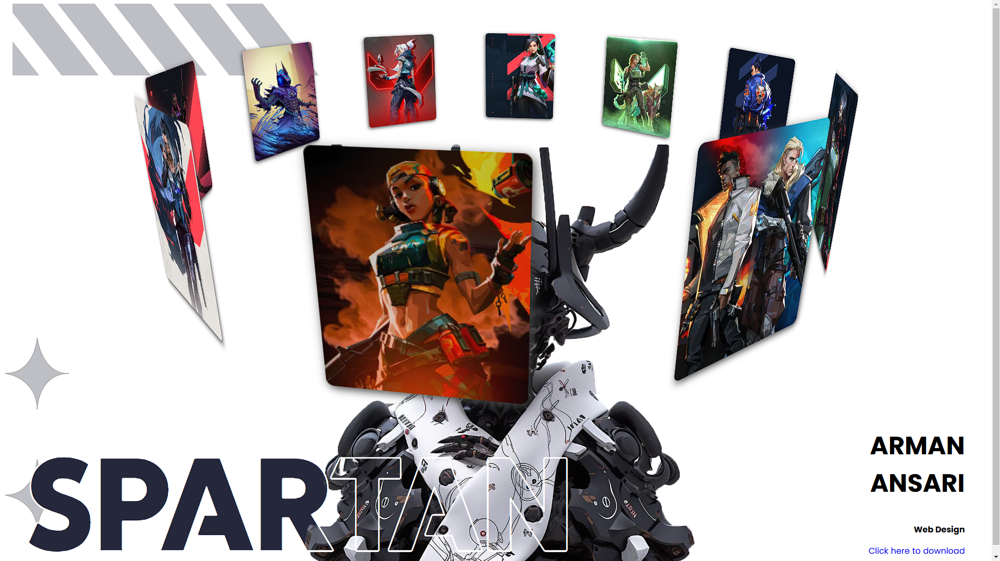

# 3D-Slider-Spartan

## Overview
This is a visually engaging, animated 3D image slider designed with CSS and JavaScript. It features a rotating gallery of images presented in a three-dimensional space, creating a modern and dynamic user experience.

## Features
- 3D rotating image slider effect
- Responsive design for various screen sizes
- Smooth animations with CSS transitions
- Images displayed in a card-like format
- Customizable image content and transitions

## Preview

## Getting Started

### Prerequisites
- HTML5
- CSS3
- JavaScript
- [Optional] A live server to view the project locally
